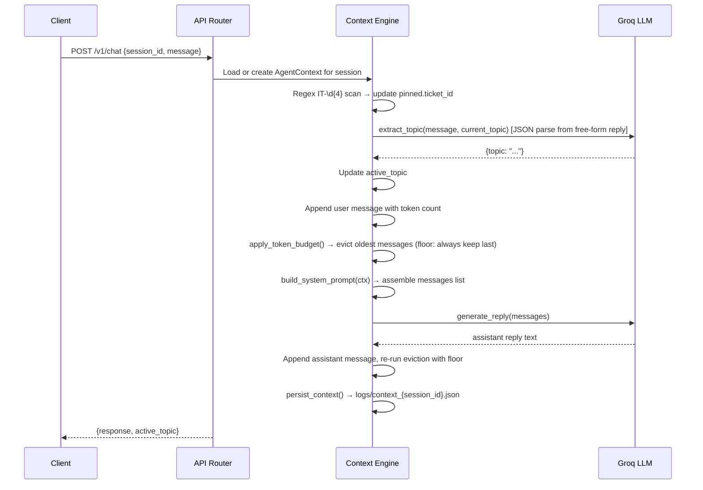

# Context-Aware IT Helpdesk Agent

A production FastAPI service that maintains per-session conversational state for an IT helpdesk chatbot. Core capabilities: rolling token-window for recent history (with a guaranteed floor so the agent is never left with zero memory), permanent pinning for extracted ticket IDs, per-turn topic classification, and full context persistence across server restarts.

LLM backend: Groq (`openai/gpt-oss-120b`) via the OpenAI-compatible SDK. Token counting: `tiktoken` with `cl100k_base`.

---

## Architecture



**On LLM failure**: the request returns HTTP 500 and the context file on disk is left in its pre-turn state. The user message is rolled back from the in-memory session before the error response is sent.

**On server restart**: `logs/context_*.json` files are scanned at startup and all sessions are reloaded into memory — no session state is lost as long as at least one successful turn completed.

---

## Setup (local)

**Requirements**: Python 3.11+

```bash
# 1. Clone and enter the project
git clone https://github.com/Rushikesh-5706/Context-Aware-IT-Helpdesk-Agent-with-Token-Budgets-and-Pinned-Memory.git
cd Context-Aware-IT-Helpdesk-Agent-with-Token-Budgets-and-Pinned-Memory

# 2. Create a virtual environment
python3 -m venv .venv
source .venv/bin/activate

# 3. Install dependencies
pip install -r requirements.txt

# 4. Configure environment
cp .env.example .env
# Edit .env and set GROQ_API_KEY to your real Groq key

# 5. Start the server
uvicorn src.api:app --reload --port 8000
```

---

## Setup (Docker)

```bash
# Build the image
docker build -t rushi5706/context-aware-it-helpdesk-agent:latest .

# Start the container (reads .env automatically)
docker-compose up -d

# Verify the app is healthy
curl http://localhost:8000/health

# Send a test message
curl -X POST http://localhost:8000/v1/chat \
  -H "Content-Type: application/json" \
  -d '{"session_id":"manual_check","message":"Hi, I need help."}'

# Stop
docker-compose down
```

The `./logs` directory is mounted as a Docker volume so context files survive container restarts.

---

## API Reference

### Endpoints

| Method | Path | Description |
|--------|------|-------------|
| `GET` | `/health` | Health check |
| `POST` | `/v1/chat` | Send a message, get a reply |
| `GET` | `/v1/context/{session_id}` | Retrieve current context for a session |

### POST /v1/chat

**Request**

```bash
curl -X POST http://localhost:8000/v1/chat \
  -H "Content-Type: application/json" \
  -d '{"session_id": "user123", "message": "My WiFi is dropping."}'
```

**Request body**

| Field | Type | Required |
|-------|------|----------|
| `session_id` | string | yes |
| `message` | string | yes |

**Response (200)**

```json
{
  "response": "Let me help you troubleshoot your WiFi...",
  "active_topic": "wifi_issue"
}
```

**Response (500)** — returned when the Groq API call fails. Context on disk is unchanged.

### GET /v1/context/{session_id}

```bash
curl http://localhost:8000/v1/context/user123
```

**Response (200)**

```json
{
  "session_id": "user123",
  "active_topic": "wifi_issue",
  "pinned": {"ticket_id": "IT-4921"},
  "recent": [
    {"role": "user", "content": "My WiFi is dropping."},
    {"role": "assistant", "content": "Let me help you troubleshoot..."}
  ],
  "total_recent_tokens": 312
}
```

**Response (404)** — when the session does not exist in memory.

---

## Environment Variables

| Variable | Default | Description |
|----------|---------|-------------|
| `GROQ_API_KEY` | — | Groq API key (required) |
| `TOKEN_BUDGET_LIMIT` | `4000` | Max tokens in rolling `recent` window |

`TOKEN_BUDGET_LIMIT` is read fresh on every request, so it can be changed without restarting the server.

---

## How eviction and pinning work

**Token budget eviction**

After each turn, `apply_token_budget(recent, max_tokens)` removes the oldest message (`pop(0)`) one at a time until the rolling window is within budget. The loop runs twice per turn — once after the user message is appended, once after the assistant reply is appended.

**Eviction floor**: the loop stops when only one message remains (`len(messages) > 1`), even if that single message exceeds the budget. This prevents the agent from being left with zero recent history (which would be context amnesia, not a rolling window). In the edge case of a single oversized assistant reply, the budget acts as a soft ceiling — the window holds one message that exceeds the limit rather than holding nothing at all.

Tokens per message are counted at append time with `tiktoken` (`cl100k_base`) so the eviction loop never re-encodes.

**Pinned memory**

The regex `IT-\d{4}` runs on every incoming user message before any LLM call. Any match is written to `pinned.ticket_id` immediately. Pinned memory is separate from `recent` — it is never counted toward the token budget and is never evicted. It appears in the system prompt on every turn so the LLM always has access to the ticket ID even if the message that mentioned it was evicted from `recent` long ago.

**Topic labels** that can appear in `active_topic`:

| Label | Meaning |
|-------|---------|
| `general` | Greeting or unrecognised intent |
| `wifi_issue` | Wireless connectivity problems |
| `network_issue` | Broader network / connectivity |
| `ticket_inquiry` | Asking about an existing support ticket |
| `hardware_issue` | Physical device problems |
| `software_issue` | Application or OS problems |
| `account_access` | Login, password, permissions |
| `email_issue` | Mail client or server problems |

---

## Running tests

```bash
# Full test suite (requires GROQ_API_KEY in .env)
pytest -v

# Eviction unit tests only (no network required)
pytest tests/test_token_eviction.py -v
```

**Test files**

| File | Requirement |
|------|-------------|
| `test_chat_endpoint.py` | req-1 — POST /v1/chat schema and status codes |
| `test_context_persistence.py` | req-2, req-9 — disk persistence and context retrieval |
| `test_entity_pinning.py` | req-3 — ticket-ID regex extraction and pinning |
| `test_token_eviction.py` | req-4 — deterministic eviction logic (no LLM) |
| `test_topic_tracking.py` | req-5 — per-turn topic classification |
| `test_error_handling.py` | req-10 — 500 on LLM failure, no context corruption |
| `test_env_config.py` | req-8 — .env.example keys, per-request budget read |

---

## Running the 5-turn evaluation

```bash
python eval_5_turns.py
```

The script starts its own isolated uvicorn server on port 8001 with `TOKEN_BUDGET_LIMIT=100` to force eviction within the first few turns. It runs 5 turns using ticket `IT-8812`, verifies pinning survives topic switches and eviction, and exits 0 on full pass or 1 with a specific failure message. No separate server needs to be running first.

**What it checks:**

| Turn | Message | Assertion |
|------|---------|-----------|
| 1 | Greeting | `active_topic` is a valid label |
| 2 | "My ticket is IT-8812." | `pinned.ticket_id == "IT-8812"` |
| 3 | Long WiFi problem message | Topic shifts to `wifi_issue`; `recent` is not empty (eviction floor held); ticket still pinned |
| 4 | Mac troubleshooting request | `recent` not empty after continued eviction; ticket still pinned |
| 5 | "Back to my original ticket" | `pinned.ticket_id == "IT-8812"`; response contains "IT-8812" |

---

## Deployment — Docker Hub

```bash
cd "/Users/rushikesh/Downloads/Context-Aware IT Helpdesk Agent with Token Budgets and Pinned Memory"

# Build
docker build -t rushi5706/context-aware-it-helpdesk-agent:latest .

# Smoke-test locally before pushing
docker-compose up -d
curl http://localhost:8000/health
docker-compose down

# Push
docker login
docker push rushi5706/context-aware-it-helpdesk-agent:latest
```

---

## Known limitations

- Session state is reloaded from `logs/context_*.json` on server startup, so restarts do not lose sessions that have completed at least one turn. Sessions that never produced a successful reply (no context file written) are not restored.
- Groq's free tier is rate-limited (~30 requests/minute). The client retries once on 429 with a 1.5-second backoff; sustained load above the rate limit will still return 500s.
- `tiktoken` with `cl100k_base` counts tokens for GPT-4-family models; Groq's `openai/gpt-oss-120b` uses a different tokenizer internally. The budget mechanism is consistent and deterministic, but the exact token counts do not map 1:1 to what Groq charges or what the model's context window accepts.
- The `json_object` response format is not supported by `openai/gpt-oss-120b` on the Groq API. Topic extraction is done by instructing the model to output raw JSON and parsing the first `{...}` block found in the response, with a fallback to the previous topic on any parse failure.
- No authentication on any endpoint. Do not expose port 8000 to the public internet without adding auth.
