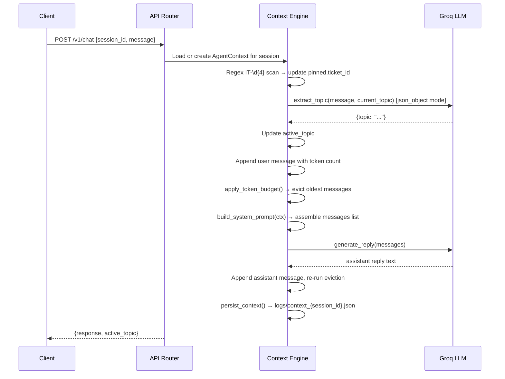

# Context-Aware IT Helpdesk Agent

A FastAPI service that maintains per-session conversational state for an IT helpdesk chatbot. It uses a rolling token window for recent history, permanent pinning for extracted entities (ticket IDs), and topic classification per turn. The LLM backend is Groq (`llama-3.3-70b-versatile`), token counting uses `tiktoken` with `cl100k_base`.

---

## Architecture



On any LLM failure (step `generate_reply`), the request returns HTTP 500 and the context file on disk is left in its pre-turn state. The user message appended to `recent` in memory is rolled back before the error response is sent.

---

## Setup (local)

**Requirements**: Python 3.11+

```bash
# 1. Clone and enter the project
git clone https://github.com/Rushikesh-5706/Context-Aware-IT-Helpdesk-Agent-with-Token-Budgets-and-Pinned-Memory.git
cd Context-Aware-IT-Helpdesk-Agent-with-Token-Budgets-and-Pinned-Memory

# 2. Create a virtual environment
python3 -m venv .venv
source .venv/bin/activate

# 3. Install dependencies
pip install -r requirements.txt

# 4. Configure environment
cp .env.example .env
# Edit .env and set GROQ_API_KEY to your real Groq key

# 5. Start the server
uvicorn src.api:app --reload --port 8000
```

---

## Setup (Docker)

```bash
# Build and start
docker-compose up -d

# Verify
curl http://localhost:8000/health

# Send a message
curl -X POST http://localhost:8000/v1/chat \
  -H "Content-Type: application/json" \
  -d '{"session_id":"manual_check","message":"Hi, I need help."}'

# Stop
docker-compose down
```

The `./logs` directory is mounted as a Docker volume so context files persist across container restarts.

---

## API Reference

### Endpoints

| Method | Path | Description |
|--------|------|-------------|
| `GET` | `/health` | Health check |
| `POST` | `/v1/chat` | Send a message, get a reply |
| `GET` | `/v1/context/{session_id}` | Retrieve current context for a session |

### POST /v1/chat

**Request**

```bash
curl -X POST http://localhost:8000/v1/chat \
  -H "Content-Type: application/json" \
  -d '{"session_id": "user123", "message": "My WiFi is dropping."}'
```

**Request body**

| Field | Type | Required |
|-------|------|----------|
| `session_id` | string | yes |
| `message` | string | yes |

**Response (200)**

```json
{
  "response": "Let me help you troubleshoot your WiFi...",
  "active_topic": "wifi_issue"
}
```

**Response (500)** — returned when the Groq API call fails. Context on disk is unchanged.

### GET /v1/context/{session_id}

```bash
curl http://localhost:8000/v1/context/user123
```

**Response (200)**

```json
{
  "session_id": "user123",
  "active_topic": "wifi_issue",
  "pinned": {"ticket_id": "IT-4921"},
  "recent": [
    {"role": "user", "content": "My WiFi is dropping."},
    {"role": "assistant", "content": "Let me help you troubleshoot..."}
  ],
  "total_recent_tokens": 312
}
```

**Response (404)** — when the session does not exist.

---

## Environment Variables

| Variable | Default | Description |
|----------|---------|-------------|
| `GROQ_API_KEY` | — | Groq API key (required) |
| `TOKEN_BUDGET_LIMIT` | `4000` | Max tokens kept in rolling `recent` window |

`TOKEN_BUDGET_LIMIT` is read fresh on every request, so it can be changed without restarting the server (useful for testing).

---

## How eviction and pinning work

**Token budget eviction**

After each turn, `apply_token_budget(recent, max_tokens)` removes the oldest message (`pop(0)`) one at a time until the total token count across `recent` is within `TOKEN_BUDGET_LIMIT`. This runs after the user message is appended and again after the assistant reply is appended.

Tokens per message are counted with `tiktoken` (`cl100k_base` encoding) at append time so the eviction loop never needs to re-encode.

**Pinned memory**

The regex `IT-\d{4}` runs on every incoming user message before any LLM call. Any match is written to `pinned.ticket_id` immediately. Pinned memory is not part of `recent` and is never evicted. It is included in the system prompt on every turn, giving the LLM persistent access to the ticket ID even after the message that originally mentioned it has been evicted from the window.

Topic labels that can appear in `active_topic`:

- `general` — greeting or unrecognised intent
- `wifi_issue` — wireless connectivity problems
- `network_issue` — broader network/connectivity
- `ticket_inquiry` — asking about an existing support ticket
- `hardware_issue` — physical device problems
- `software_issue` — application or OS problems
- `account_access` — login, password, permissions
- `email_issue` — mail client or server problems

---

## Running tests

```bash
# Full test suite (requires GROQ_API_KEY in .env)
pytest -v

# Eviction unit tests only (no network required)
pytest tests/test_token_eviction.py -v
```

---

## Running the 5-turn evaluation

The script connects to a running server on `localhost:8000`. Start the server first, then:

```bash
python eval_5_turns.py
```

It sets `TOKEN_BUDGET_LIMIT=100` internally to force eviction by turn 3, runs 5 turns with ticket `IT-8812`, and exits 0 on full pass or 1 with a specific failure message.

---

## Known limitations

- Session state is in-memory only. Restarting the server loses all sessions (context files on disk survive but are not reloaded into memory on startup).
- Groq's free tier is rate-limited (~30 requests/minute). The client retries once on 429 with a 1.5-second backoff; sustained load above the rate limit will still return 500s.
- `tiktoken` with `cl100k_base` counts tokens for GPT-4-family models; Groq's `llama-3.3-70b-versatile` uses a different tokenizer internally. The budget mechanism is consistent and deterministic, but the exact token counts do not map 1:1 to what Groq charges or what the model's context window accepts.
- No authentication on any endpoint. Do not expose port 8000 to the public internet without adding auth.
